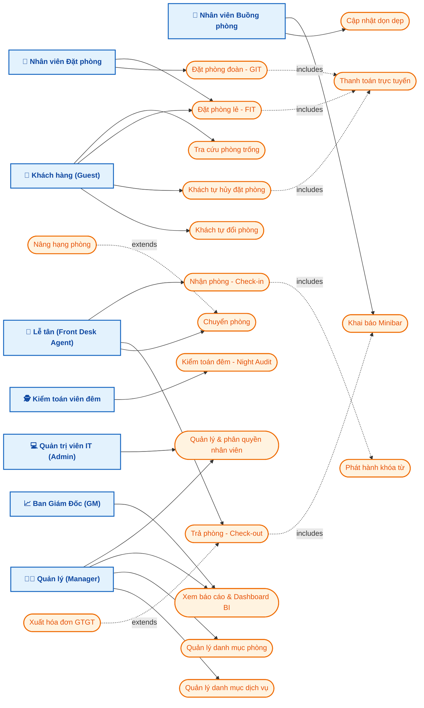

# SƠ ĐỒ USE CASE (USE CASE DIAGRAM) HỆ THỐNG PMS

**Tài liệu:** Use Case Diagram Specification  
**Vai trò thiết kế:** Solution Architect  
**Mô tả:** Sơ đồ Use Case cập nhật bổ sung tác nhân Khách hàng (hủy phòng, tự đổi phòng, thanh toán online) và tác nhân Quản lý (Manager).

---

## 1. SƠ ĐỒ USE CASE MERMAID

